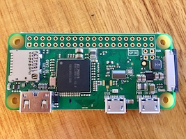
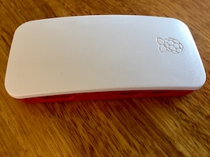
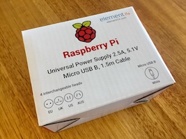

My project today is to set up a [Pi-hole](https://pi-hole.net) on a Raspberry Pi Zero. Pi-hole is a [DNS sinkhole](https://en.wikipedia.org/wiki/DNS_sinkhole) that can run on a lightweight linux server. It's great for blocking ad trackers and beacons, for security and privacy, speeding up the loading of web pages and using less battery and data on mobile. I'm making this one for my friends A&B who have kids, so we'll set it up with porn blocking too.

# Parts

I'm in Australia so I ordered these from [Core Electronics](https://core-electronics.com.au). [Pimoroni](https://shop.pimoroni.com) in the UK and [Adafruit](https://www.adafruit.com) in the US are both good.

- [Raspberry Pi Zero W](https://www.raspberrypi.org/products/raspberry-pi-zero-w/). Any linux server will work. You can use a linux NAS, or a single board computer like a Pi. If you're using a zero, make sure you get the W which has wifi.

  

- A Pi Zero [enclosure](https://www.raspberrypi.org/products/raspberry-pi-zero-case/). Endless options here. I'm just using the official case. It's nice enough and supports the Raspberry Pi foundation.

  

- [Power supply](https://www.raspberrypi.org/products/raspberry-pi-universal-power-supply/). You could probably power this zero off a usb wall wart just fine. I want this Pi-hole to be as rock solid as possible - plug it in and not have to worry about it, so I'm using the official Raspberry Pi power supply.

  

- A micro SD card. A 4gb card is big enough. I'm using a 16gb card I had lying around.

  

- You'll also need a computer with some manner of micro sd card slot or adapter or reader. I'll be using my macbook with a usb card reader.

# Assemble the power supply

I had to take off the UK prongs and snap on the Australian ones. There's a tab in the middle of each adapter you push in to slide it off.

# Setup SD Card

The SD card stores the software for the Pi. You need to write an operating system to the card and configure it to connect to your wireless network on start up.

## Put an OS image on the the card

Download the Raspbian Lite image from the Pi foundation [downloads page](https://www.raspberrypi.org/downloads/raspbian/) and install according to their [installation guide](https://www.raspberrypi.org/documentation/installation/installing-images/README.md). I follow their advice and use Etcher for this.

## Configure for your network

I mount the card on my Mac. There's only one partition, called boot. Add a new file named `wpa_supplicant.conf` containing the following text

    country=COUNTRY
    ctrl_interface=DIR=/var/run/wpa_supplicant GROUP=netdev
    update_config=1

    network={
        ssid="SSID"
        psk="PASSWORD"
        key_mgmt=WPA-PSK
    }

Replace `COUNTRY` with your country's two-letter code, `AU` in my case. Fill in your network's name for `SSID`, and your also your password.

To enable ssh on the Pi, create an empty file in the boot volume called `ssh`.

## Test the SD card

I eject the SD card and pop it into the Pi. I plug the power supply into the `PWR` port. The Pi takes a while to boot up the first time - give it a couple of minutes.

If all is well, the Pi will now connect automatically to your network. You want to know its local address. You could use a tool like nmap, or look in your router's admin console. I like to just pick up my phone and open the [Fing](https://itunes.apple.com/au/app/fing-network-scanner/id430921107) app. It tells me there's a new host called raspberrypi at `10.1.1.8`.

So I can now try to ssh into the Pi from my Mac.

    $ ssh pi@10.1.1.8

The default password is `raspberry`. It works, great. Now I can shut it down to put it in the case.

    $ sudo shutdown -h now

# Assembly

Unplug the power and insert the board under the red tab, chip side up. Push down onto the mounts. Here's a video that might help [https://www.youtube.com/watch?v=xjRFtqHAztA](https://www.youtube.com/watch?v=xjRFtqHAztA) if you're unsure. 

If you bought your Pi Zero in a kit, it may have come with a little passive heatsink. You can put that on now if you wish, but I wouldn't bother.

Put the full closed white lid on. Stick on the feet.

# Configure the Pi

Plug in the power again and ssh back into the Pi. Update Raspbian:

    $ sudo apt update
    $ sudo apt upgrade

I want this Pi-hole to be as low-power as possible. I can disable HDMI to save a few milliamps. `sudo nano /etc/rc.local` and add the following above `exit 0`

    tvservice -o

Save a little more power by disabling bluetooth and the activity LED. `sudo nano /boot/config.txt` and add

    dtoverlay=pi3-disable-bt
    dtparam=act_led_trigger=none
    dtparam=act_led_activelow=on

Now run `sudo raspi-config` and change the following settings
- `Change User Password`
- `Network Options` > `Hostname`. I change mine from `raspberrypi` to `pihole`
- `Boot Options` > `Wait for Network at Boot`. Select Yes.
- `Localisation Options` > `Change Locale`. I set up `en_AU.UTF-8`
- `Localisation Options` > `Change Timezone`
- `Interfacing Options`. Turn off everything except SSH.
- `Advanced Options` > `Memory Split`. Set the GPU's memory share to the minimum 16MB.

Let the Pi restart and ssh in again. Try using the hostname you just set, eg.

    $ ssh pi@pihole.local

To force sudo to require a password, `sudo nano /etc/sudoers.d/010_pi-nopasswd`
and change the `pi` entry to:

    pi ALL=(ALL) PASSWD: ALL

## Firewall

May as well set up a firewall with `ufw`.

    $ sudo apt install ufw
    $ sudo ufw limit 22/tcp # ssh
    $ sudo ufw allow 80/tcp # http for the web ui
    $ sudo ufw allow 53     # dns
    $ sudo ufw enable

# Install Pi-hole

    curl -sSL https://install.pi-hole.net | bash

At the prompts:
- Select an upstream provider. Google is fine.
- Keep the defaults for other settings.
- Set an admin password for the web UI when prompted.

# Use the Pi-hole for DNS

Devices on the local network can individually be set to use the pi-hole, but you're probably just going to want to setup your router to tell the whole local network about the pi-hole. Go into the router's admin panel, find the DHCP or DNS settings, and enter the Pi's address as the DNS server. While you're there you might want to explicitly instruct the router to always allocate the Pi the same static address.

# Pi-hole Configuration

Now you go to http://pi.hole to use the web admin tool, or use the `pihole` command line tool over ssh.

## Additional Blocklists

You can subscribe to additional blocklists in the blocklists tab of the settings panel.

On my own Pi-hole I block Facebook using the list at [PrivacyHostList](https://github.com/BartsPrivacy/PrivacyHostList) on github by adding `https://raw.githubusercontent.com/BartsPrivacy/PrivacyHostList/master/BlockHosts-Facebook.txt` as a blocklist.

## Porn Blocking

The pi-hole i'm building today is mainly intended to keep kids from accidentally falling into some dark corners.

First, I use the [OpenDNS FamilyShield](https://www.opendns.com/home-internet-security/) nameservers for upstream DNS. That's a broad hammer -- there's no way to whitelist a domain, or to get stats for troubleshooting. So we might not continue with that, but I'll try it out. In the web UI > Settings > DNS, I enter custom server addreses `208.67.222.123` and `208.67.220.123` and uncheck the Google servers.

Second, [Steven Black](https://github.com/StevenBlack/) has collated [some hosts lists](https://github.com/StevenBlack/hosts). I use the Unified hosts + fakenews + gambling + porn list by adding `https://raw.githubusercontent.com/StevenBlack/hosts/master/alternates/fakenews-gambling-porn/hosts` as a blocklist.

Third, [Chad Mayfield](https://github.com/chadmayfield) has [assembled a list](https://chadmayfield.com/2017/06/29/blocking-porn-with-pihole/) of the top ~ 20,000 porn sites. That could be used as a blocklist; problem is, it doesn't match subdomains. So porn.com is filtered, but not www.porn.com, which makes it ineffective as a blocklist. Pi-hole has regular expression blocking though, so my idea is to turn Chad's list into a list of regexen which will also match against subdomains.

    $ curl https://raw.githubusercontent.com/chadmayfield/my-pihole-blocklists/master/lists/pi_blocklist_porn_top1m.list | sed 's/.*/(^|\\.)&$/' | sudo tee -a /etc/pihole/regex.list
    $ sudo service pihole-FTL restart

# Whitelisting and Blacklisting

There are some tips for particular sites and services on the Pi-hole wiki at [Whitelisting-and-Blacklisting-tips](https://github.com/pi-hole/pi-hole/wiki/Whitelisting-and-Blacklisting-tips).

Chad Mayfield has a bunch of commonly whitelisted domains in his Pi-hole [install script](https://github.com/chadmayfield/my-pihole-blocklists/blob/master/install.sh). I going to steal that idea and list and do the same:

    $ whitelist=(
        "clients4.google.com" 
        "clients3.google.com" 
        "s.youtube.com"
        "video-stats.l.google.com"
        "spclient.wg.spotify.com"
        "www.msftncsi.com" 
        "outlook.office365.com" 
        "products.office.com" 
        "c.s-microsoft.com" 
        "i.s-microsoft.com" 
        "login.live.com"
        "g.live.com"
        "dl.delivery.mp.microsoft.com" 
        "geo-prod.do.dsp.mp.microsoft.com" 
        "displaycatalog.mp.microsoft.com" 
        "officeclient.microsoft.com"
        "s.gateway.messenger.live.com" 
        "ui.skype.com" 
        "pricelist.skype.com" 
        "apps.skype.com" 
        "m.hotmail.com" 
        "s.gateway.messenger.live.com" 
        "sa.symcb.com" 
        "s1.symcb.com"
        "s2.symcb.com"
        "s3.symcb.com"
        "s4.symcb.com"
        "s5.symcb.com"
        "plex.tv" 
        "tvdb2.plex.tv" 
        "pubsub.plex.bz" 
        "proxy.plex.bz" 
        "proxy02.pop.ord.plex.bz" 
        "cpms.spop10.ams.plex.bz" 
        "meta-db-worker02.pop.ric.plex.bz" 
        "meta.plex.bz" 
        "tvthemes.plexapp.com.cdn.cloudflare.net" 
        "tvthemes.plexapp.com" 
        "106c06cd218b007d-b1e8a1331f68446599e96a4b46a050f5.ams.plex.services" 
        "meta.plex.tv" 
        "cpms35.spop10.ams.plex.bz" 
        "proxy.plex.tv" 
        "metrics.plex.tv" 
        "pubsub.plex.tv" 
        "status.plex.tv" 
        "www.plex.tv" 
        "node.plexapp.com" 
        "nine.plugins.plexapp.com" 
        "staging.plex.tv" 
        "app.plex.tv" 
        "o1.email.plex.tv" 
        "o2.sg0.plex.tv" 
        "dashboard.plex.tv"
        "gravatar.com" 
        "thetvdb.com" 
        "themoviedb.com" 
        "services.sonarr.tv" 
        "skyhook.sonarr.tv" 
        "download.sonarr.tv" 
        "apt.sonarr.tv" 
        "forums.sonarr.tv"
    )

    $ pihole whitelist ${whitelist[@]}

# Automatic Security Updates

I want this little server to automatically apply security updates. For that I use the `unattended-upgrades` package.

    $ sudo apt install unattended-upgrades update-notifier-common

Now I `sudo nano /etc/apt/apt.conf.d/50unattended-upgrades` and set the following options

    Unattended-Upgrade::Remove-Unused-Dependencies "true";    Unattended-Upgrade::Automatic-Reboot "true";
    Unattended-Upgrade::Automatic-Reboot-Time "03:30";

The results of unattended-upgrades will be logged to `/var/log/unattended-upgrades`.
